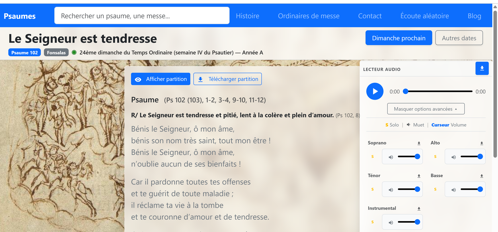
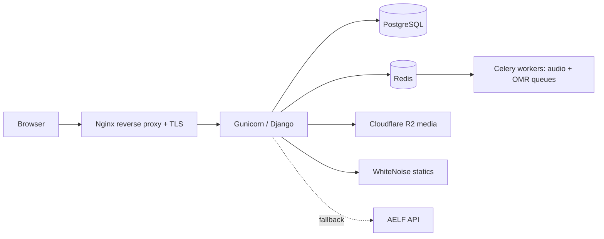

# Cantateo — daily liturgical psalms, live in production

[](https://github.com/xavierxav/cantateo/actions/workflows/ci.yml)
[](pyproject.toml)
[](requirements-lock.txt)
[](LICENSE)

**Live production app: https://www.cantateo.fr** — full-stack Django application serving the daily liturgical psalm with PDF score and multi-track SATB audio (Soprano, Alto, Tenor, Bass + instrumental), backed by PostgreSQL full-text search and a computed liturgical calendar with AELF fallback.



## Architecture



## Engineering highlights

- **Web Audio multitrack engine** — one synced player per partition with drift correction and Safari/iOS fallback tempo variants (`static/js/audio-engine/`, `static/js/audio-player/`, `docs/STATIC.md`)
- **Computed liturgical calendar** — Easter-based calculation (years A/B/C, parities, feasts) with AELF API fallback and 12 h per-date cache (`psaumes/services/liturgie/`, `docs/LITURGICAL_CALENDAR.md`)
- **Accent-insensitive fuzzy search** — PostgreSQL `pg_trgm` + `unaccent` over psalm texts and titles
- **Async audio generation** — Celery + Redis (`audio`, `omr` queues) rendering MP3 tracks and MusicXML from scores; UI polls generation status
- **Production guardrails** — CSP nonces, rate limits, Turnstile on contact, PDF/MP3/MXL upload validators, `/healthz/` checks

## Features

- **Daily chant** — psalm/canticle of the day with PDF partition and 5 audio tracks
- **Calendar navigation** — any date, next-Sunday jump, liturgical year view
- **Search** — accent-insensitive fuzzy search (PostgreSQL `pg_trgm` + `unaccent`)
- **Audio engine** — Web Audio multitrack mixer, tempo variants, Safari-safe playback
- **LLM import pipeline** — PDFs → structured psalm data + metadata via the Google Gemini API (`import_scripts/`, see below)
- **Production guardrails** — CSP nonces, rate limits, upload validators, health checks

### Import pipeline (one-shot, LLM-assisted)

Score folders (PDFs, plus MP3/MXL where present) are text-extracted with PyMuPDF, then parsed by the Google Gemini API via `google-genai` into structured psalm/canticle rows (`Psaume`), liturgical moments (`MomentLiturgique`), and `Partition` audio metadata. Key comes from the `GEMMA_API_KEY` env var (default model in `import_base.py`: `gemini-3.1-flash-lite`); entry points are `import_psaumes.py` / `import_fonsalas.py` in `import_scripts/`.

## Stack

Django 5.2 · PostgreSQL (`pg_trgm`) · Redis + Celery · Cloudflare R2 · WhiteNoise · Gunicorn + Nginx · Hetzner VPS

## Deployment

Self-hosted Hetzner VPS (Ubuntu 22.04): Gunicorn behind Nginx over a Unix socket, PostgreSQL + Redis/Celery (systemd units in `deploy/`, install via `deploy/deploy.sh` + `deploy/setup-server.sh`), media on Cloudflare R2, daily `pg_dump` backups via `deploy/backup.sh`. Details in [`docs/HETZNER.md`](docs/HETZNER.md).

## Quick start

```bash
source venv/bin/activate
pip install -r requirements.txt -c requirements-lock.txt
cp .env.example .env   # fill credentials
python manage.py migrate
python manage.py runserver  # http://127.0.0.1:8000/
```

## Verify

```bash
pytest
ruff check .
python manage.py check
python manage.py check --deploy
pip-audit -r requirements.txt
```

## Docs

Full map in [`docs/README.md`](docs/README.md): models, views, templates, static/audio architecture, liturgical calendar + AELF, local setup, Hetzner deploy, media layout, vendored assets.

## Project layout

```
psalm_project/    Django settings (base / development / production / ci)
psaumes/          Main app: models (Psaume, Partition, MomentLiturgique), views, services, admin
static/js/        audio-engine/ (Web Audio multitrack) + audio-player/ (UI)
deploy/           Hetzner VPS scripts, systemd units, nginx.conf
docs/             Architecture and operations documentation
```

`templates/admin/base_site.html` is an intentional Django admin branding override; app templates live in `psaumes/templates/`. `import_scripts/` holds one-shot data imports (excluded from lint).

## License

Non-commercial use only — see [LICENSE](LICENSE). No commercial use without prior written permission.

---

**Cantateo** — *singing psalms together*
