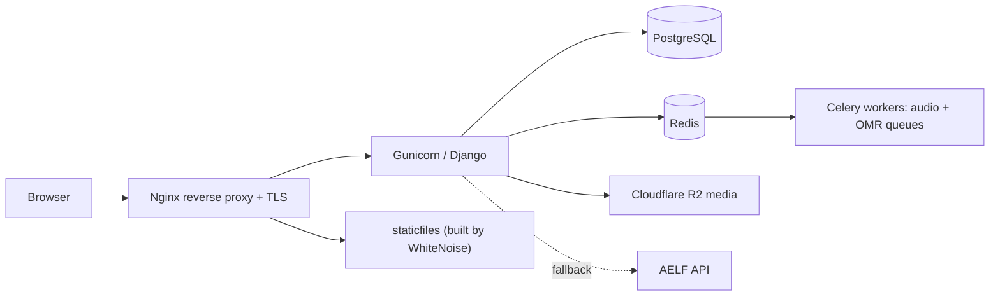

# Cantateo — the day's psalms, in tune

[](https://github.com/xavierxav/cantateo/actions/workflows/ci.yml)
[](pyproject.toml)
[](requirements-lock.txt)
[](LICENSE)

Live: **https://www.cantateo.fr**

A Django web app that serves the daily liturgical psalm with its PDF score and a
multi-track SATB recording (Soprano, Alto, Tenor, Bass + instrumental), built for
choirs rehearsing together.


## The story

My uncle composed all the psalms used during Mass and published them on a Wix
site. The site was limited, buggy, and costly — several hundred euros a year for
an interface that struggled with his catalogue.

I took it as an opportunity: my first full-stack project, and a way to get
comfortable with **agentic coding**. The result replaces the paid site, serves
the real recordings, and became my playground for production-grade practices.

## What it does

- **Daily psalm** — the psalm or canticle of the day with its PDF score and 5
  synchronized audio tracks.
- **Calendar navigation** — pick any date, jump to the next Sunday, browse the
  liturgical year.
- **Search** — accent-insensitive fuzzy search across psalm/canticle text.
- **Multitrack player** — mix voices live: per-track volume, mute/solo, seek,
  and tempo.
- **Score generation** — upload a score, process it, and derive playable audio.
- **LLM import pipeline** — score PDFs are text-extracted, then parsed into
  structured psalm data by the Google Gemini API.

## Architecture decisions

Each choice below is a *problem → decision → trade-off*, not a default.

### Django, pragmatically

I already knew Python, and this was my first full-stack app. Django gave me the
admin, the ORM, migrations and authentication out of the box, so I could focus
on the hard parts (audio, liturgy) instead of rebuilding plumbing.

**Trade-off:** heavier and more opinionated than a micro-framework, but the
shipped surface per learned concept was far better. The project reaches for
frameworks only where the problem is genuinely hard; the frontend stays vanilla
JS (no bundler, no SPA) to keep the production surface small.

### Multitrack Web Audio — and the Safari wall

The player had to keep 5 independent tracks perfectly in sync while letting users
change tempo. I built it on the **Web Audio API** with per-track `GainNode`s,
periodic drift correction, and a continuous speed slider on desktop.

Then Safari broke it. On iOS, re-routing media through Web Audio and changing
`playbackRate` mid-stream misbehaves — a documented platform limitation, not a
bug I could fix. So I adapted rather than fought it:

- **Non-Safari:** media elements through `MediaElementAudioSourceNode`, live
  mixing, continuous tempo slider.
- **Safari at 1.0x:** decoded `AudioBufferSourceNode` for tighter starts.
- **Safari tempo change:** the backend **pre-renders stems at 0.5x / 1.0x /
  1.5x**; the browser exposes 3 tempo buttons and plays them at native speed.
  Same feel, zero fragile audio routing.

**Lesson:** the right answer to a platform constraint is often to move the
complexity server-side. The UI stayed simple; the browser stayed stable.

### A Hetzner VPS, on purpose

Hosting is a small **Hetzner VPS** with Nginx, Gunicorn, systemd and scheduled
backups; media lives on **Cloudflare R2**. It is deliberately bare: no managed
PaaS on top. That was an economic win and, more importantly, a way to learn to
run a server autonomously — deploys, TLS, logs, restarts, backups.

**Trade-off:** more responsibility than a managed platform, and the kind of
knowledge no tutorial gives you until you own the machine.

### Tests as a development engine

The project is test-heavy on purpose: `pytest` + `pytest-django` for the domain,
**Playwright** smoke tests for real browser paths, ruff for static checks, and a
CI pipeline that gates every change.

In agentic development this matters twice. Tests enforce best practices, **and**
they give the agent a tight feedback loop — every red/green cycle is a cheap
iteration. Good tests are what make fast automated changes safe.

### Agentic coding: the harness is the leverage

I treat agentic coding as an engineering discipline, not autocomplete. The single
biggest lesson from this project: **without a good harness, the time you save
writing code you spend debugging. With one, you genuinely save time — and your
attention moves up to architecture and structural decisions.**

Concretely, what I now consider non-negotiable:

- **Keep current with model releases.** The cost/performance frontier moves fast;
  switching models live is one of the highest-leverage things you can do.
- **Take the best-practice path, even when it looks too heavy for the project.**
  Agents handle real complexity far better than the old "keep it light" instinct
  assumed, and in an agentic workflow a minimal stack buys you little. If I did
  this again I would **not** choose vanilla JS — a frontend framework would have
  paid for itself.
- **Set up tests, linters and a method plugin early.** I lost a lot of time
  before wiring up pytest, Playwright, ruff and a workflow plugin like
  **Superpowers**. That setup *is* the harness.
- **Superpowers gave me a method:** brainstorm the idea, write a spec, turn it
  into a plan, then execute in small reviewed increments. The tooling is fast;
  the method is what keeps a fast agent from drifting.

This README and the publication of this repo came out of that same workflow.

### LLM-assisted import pipeline

Restoring a catalogue of score PDFs by hand doesn't scale. The import pipeline
text-extracts each PDF with PyMuPDF, then asks the **Google Gemini API** to parse
it into structured `Psaume`, `MomentLiturgique` and `Partition` rows — a one-shot
job, but a real force multiplier for a data-heavy project.

### Liturgy is computed, not hardcoded

The liturgical calendar (Easter computation, seasons, feast names) is derived in
code, with **AELF** as a fallback source for colors and texts. Everything is
timezone-aware to Paris, so "today" is correct around midnight.

### Production guardrails from day one

CSP with per-request nonces, rate-limited public endpoints, Turnstile on the
contact form, validated uploads (PDF/MXL/MP3), and a `/healthz/` check covering
app, database and cache. Small app, real deployment.

## How it works



A date request resolves a `MomentLiturgique`; the computed calendar validates it
(or falls back to AELF), and the `Psaume` + `Partition` render with their PDF
score and audio tracks. Audio is mixed client-side by the Web Audio engine, while
Celery generates tracks, tempo variants and normalization in the background with
user/bulk queue priorities.

## Tech stack

Django 5.2 · PostgreSQL (`pg_trgm`, `unaccent`) · Redis + Celery · Cloudflare R2
· WhiteNoise · Gunicorn + Nginx · Hetzner VPS · pytest + Playwright

## What I learned

- **Boring backend choices ship.** Django let a first full-stack project
  actually reach production — on the frontend, I'd trade "no framework" for real
  structure next time.
- **Constraints are design input.** The Safari limitation produced a simpler,
  more robust architecture than the "clever" one.
- **The harness is leverage.** Tests and linters don't just enforce best
  practice; they are the feedback loop that makes agentic changes safe.
- **What I'd do next:** adopt a frontend framework, add more browser coverage,
  tighten linting, and keep hardening the deploy.

<details>
<summary><strong>Development</strong> — local setup, verification, layout</summary>

### Quick start

```bash
source venv/bin/activate
pip install -r requirements.txt -c requirements-lock.txt
cp .env.example .env   # fill credentials
python manage.py migrate
python manage.py runserver  # http://127.0.0.1:8000/
```

### Verify

```bash
pytest
ruff check .
python manage.py check
python manage.py check --deploy
pip-audit -r requirements.txt
```

### Project layout

```
psalm_project/    Django settings (base / development / production / ci)
psaumes/          Main app: models (Psaume, Partition, MomentLiturgique),
                  views, services, tasks, admin
static/js/        audio-engine/ (Web Audio multitrack) + audio-player/ (UI)
deploy/           Hetzner VPS scripts, systemd units, nginx.conf
docs/             Architecture and operations documentation
```

`templates/admin/base_site.html` is an intentional Django admin branding
override; app templates live in `psaumes/templates/`. `import_scripts/` holds
one-shot data imports (excluded from lint).

### Docs

Full map in [`docs/README.md`](docs/README.md): models, views, templates,
static/audio architecture, liturgical calendar + AELF, local setup, Hetzner
deploy, media layout, vendored assets.

</details>

## License

Non-commercial use only — see [LICENSE](LICENSE). No commercial use without prior
written permission.

---

**Cantateo** — *singing psalms together*
