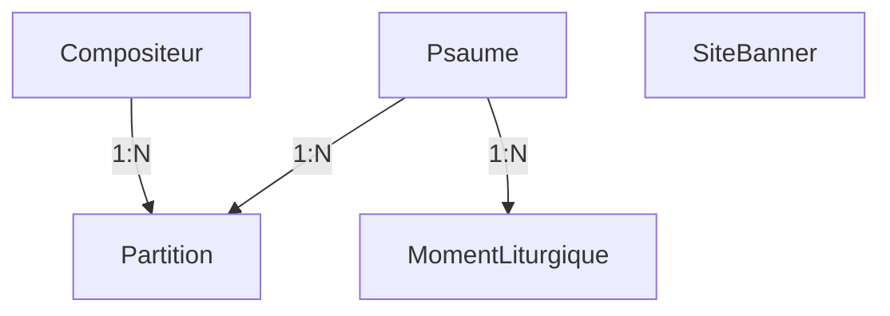

# Database Schema Documentation

## Models Hierarchy

**Note**: `Psaume` is the liturgical entity (e.g., Psalm 23 or a Canticle). `Partition` is a musical arrangement of that psalm. Multiple arrangements (Partitions) can exist for a single `Psaume`. `MomentLiturgique` links a date/occasion to a specific `Psaume`.

## Psaume (Liturgical Entity)

| Field | Type | Description |
|-------|------|-------------|
| psaume_or_cantique | CharField | 'psaume' or 'cantique' |
| nom_psaume | CharField | Main identifier (e.g. "Psaume 23" or "Cantique Is 12,1-6") |
| titre | CharField | Main title for display |
| slug | SlugField | SEO-friendly URL slug (auto-generated) |
| nom_complet_recherche | TextField | Search field aggregating titre and all partition refrains |

## Partition (Musical Arrangement)

| Field | Type | Description |
|-------|------|-------------|
| titre | CharField | Arrangement title |
| psaume | FK(Psaume) | Related psalm/cantique (`related_name='partitions'`) |
| compositeur | FK(Compositeur) | Composer reference |
| refrain | TextField | Refrain text (used for search) |
| versets | TextField | Verses text |
| partition_pdf | FileField | PDF score file |
| partition_mxl | FileField | MusicXML source file |
| audio_soprano | FileField | Soprano audio track |
| audio_alto | FileField | Alto audio track |
| audio_tenor | FileField | Tenor audio track |
| audio_basse | FileField | Basse audio track |
| audio_instrumental | FileField | Instrumental audio track |
| audio_mix | FileField | Mixed audio track |
| mp3_synthetiques | BooleanField | True if audio was automatically generated from MXL |
| slug | SlugField | SEO-friendly URL slug (auto-generated) |

## MomentLiturgique

Linked to [psaumes/models/moment_liturgique.py](psaumes/models/moment_liturgique.py).

### Types and Validation Rules

| Type | Required Fields | Validation |
|------|-----------------|------------|
| **DIMANCHE** | temps, semaine, jour=0, annee (A/B/C) | parite must be empty |
| **SEMAINE** | temps, semaine, jour (1-6), parite (P/I) | annee must be empty |
| **FETE fixe** | nom_fete | temps, semaine, jour, parite, annee must be empty |
| **FETE cyclique** | nom_fete, annee (A/B/C) | temps, semaine, jour, parite must be empty |

### Field Values

| Field | Values |
|-------|--------|
| temps | AVENT, NOEL, ORDINAIRE, CAREME, SAINT, PASCAL |
| semaine | 1, 2, 3, 4... (week number) |
| jour | 0=Dimanche, 1=Lundi ... 6=Samedi |
| annee | A, B, C (Sundays and cyclic feasts) |
| parite | P=paire, I=impaire (weekdays only) |
| nom_fete | Nativite, Ascension, Sainte Trinité, Christ-Roi, etc. |
| nom_complet_recherche | Auto-generated text for search (includes ordinal words like "premier") |

### Constraints

The model enforces uniqueness via `Meta.constraints`:
- `unique_dimanche`: (temps, semaine, jour, annee) where jour=0.
- `unique_semaine`: (temps, semaine, jour, parite) where jour > 0.
- `unique_fete`: (nom_fete, annee).

## Compositeur

| Field | Type | Description |
|-------|------|-------------|
| nom | CharField | Full name (unique) |
| description | TextField | Biographical info or notes |

## SiteBanner

| Field | Type | Description |
|-------|------|-------------|
| text | TextField | Banner content with sanitized Markdown-style formatting and approved icon shortcodes |
| active | BooleanField | Whether it's currently displayed |
| start_date | DateField | Optional schedule start |
| end_date | DateField | Optional schedule end |

## Search Implementation

PostgreSQL `pg_trgm` + `unaccent` for fuzzy, accent-insensitive search.
1. **Psaumes**: Searched via `nom_complet_recherche`. Updated by `pre_save` signal to include its own title/reference and the refrains of ALL linked partitions.
2. **Moments**: Searched via `nom_complet_recherche`. Updated by `pre_save` signal to include liturgical terms and their ordinal string equivalents (e.g., "1" -> "premier"). `Sainte Trinité` is canonical; `Trinité` remains accepted as an alias for legacy data and imports.
